# FinalProjectAssessmentForScalefocusAcademy

Deploy a WordPress on Kubernetes (using Minicube) with Helm and
automation with Jenkins.

1. Setup the enviroment

- Started with instaling java 11

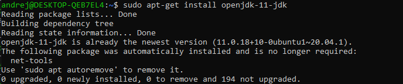

- Next I'v installed Jenkins 

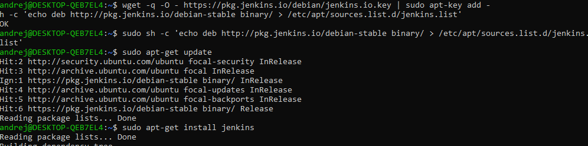

- To start Jenkins in linux cli, it starts on http://localhost:8080/

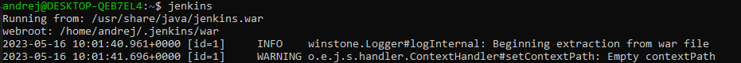

- After Jenkins, I'v started MiniKube. 

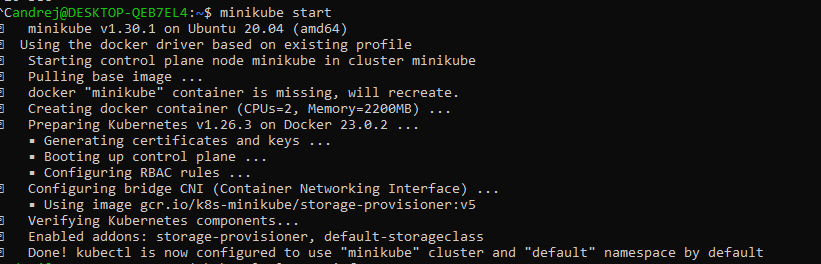

`minikube start` or `minikube start --driver=docker` , we can use one of these commands

- Helm installation 

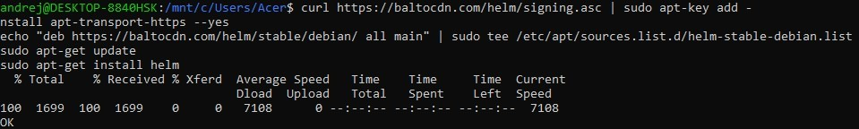

- And check version of Helm 

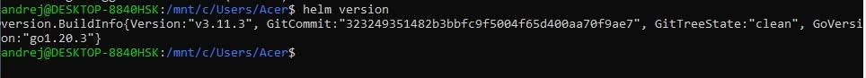

2. Make a repository on GitHub with name : `Final Project Assessment for Scalefocus Academy`

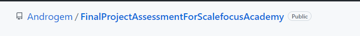

3. Download specific Helm Chart of this github repo : https://github.com/bitnami/charts/tree/main/bitnami/wordpress 
I used : https://download-directory.github.io

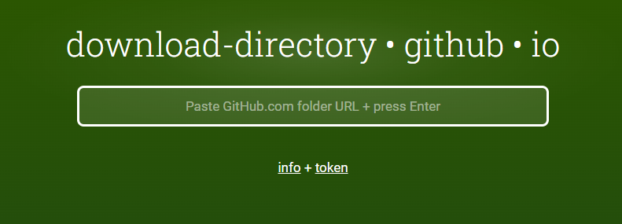

4. We need to change the line 534 in the /wordpress/value.yaml from the downloaded folder 

    `type: LoadBalancer`

        into

    `type: ClusterIP` 

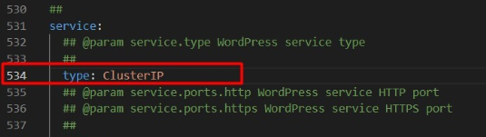

5. Next i've configured Jenkins server who is running on localhost:8080

- First we need to configure kubernetes plugins 

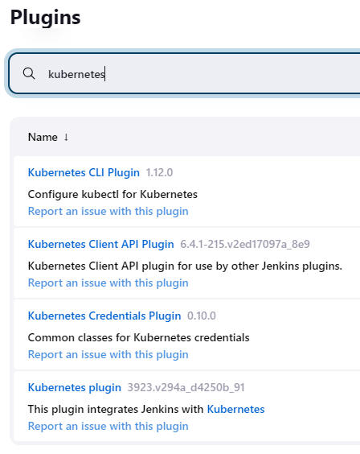

- Then we need to add kubernetes cloud with these formation :
     

     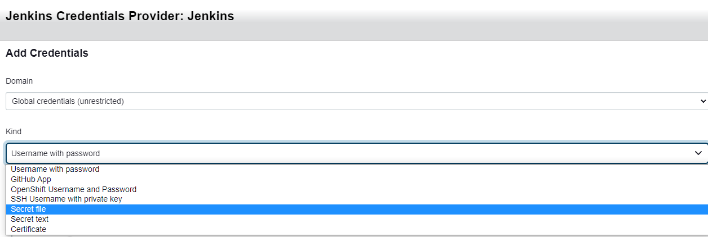

     the path for the secret file will be `/.kube/config`

     the command `kubectl cluster-info` will show us the Kubernetes control plane ip :
     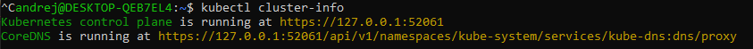

     then we click Save

- After configuring the Jenkins plugins and credentials, we move on to create pipline 

    + New Itemn and then 
    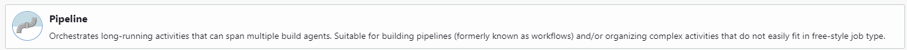

    The definition of the pipeline script can be done in two ways. One way is to use a Jenkinsfile, which is uploaded to a GitHub repository. The other way is to directly enter the pipeline script into the Jenkins server.

    
- I chose the first option :
    jenkinsfile : https://github.com/Androgem/FinalProjectAssessmentForScalefocusAcademy/blob/main/Jenkinsfile 
    with this jenkinsfile we want to checks if wp namespace exists, if it doesn’t then it creates one.
    Checks if WordPress exists, if it doesn’t then it installs the chart

    You maybe wil have this error. 

    

    So, I updated the Jenkinsfile with `helm dependency update` as stage and after that I've use `helm upgrade --install final-project-wp-scalefocus wordpress -n wp --values wordpress/values.yaml`  

    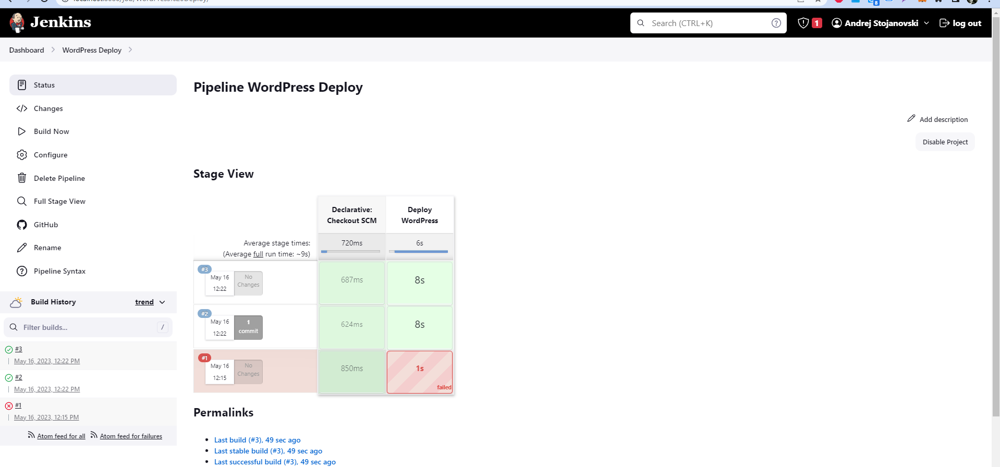

    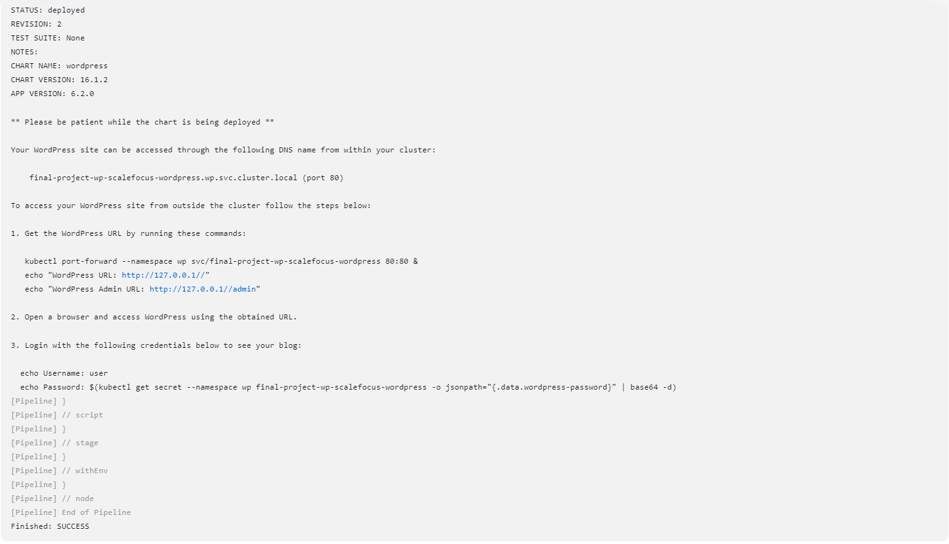

 6. Next we need to run the command `kubectl port-forward --namespace wp svc/final-project-wp-scalefocus-wordpress 8080:80` 
    but I've got a error : `Unable to listen on port 8080`
    
     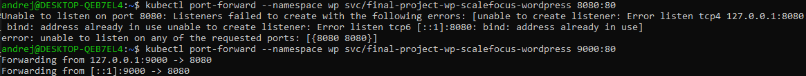

    So I've used the port 9000:90 : `kubectl port-forward --namespace wp svc/final-project-wp-scalefocus-wordpress 9000:80` 

 7. Login to WordPress Dashboar after using these commands: 
    `echo Password: $(kubectl get secret --namespace wp final-project-wp-scalefocus-wordpress -o jsonpath="{.data.wordpress-password}" | base64 -d)` 
    to show the password 
    
    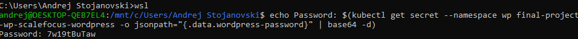

 8. Admin Dashboard:
    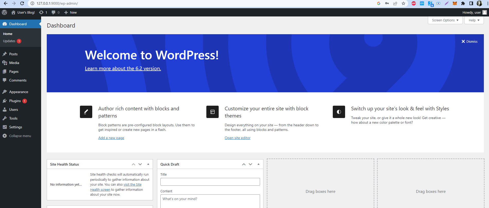